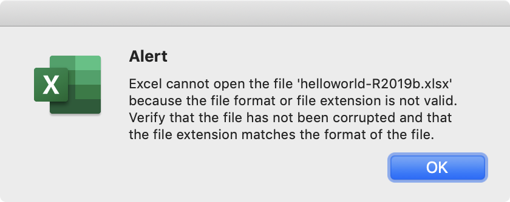

# repro-poi-corrupt-xml

This reproduces a bug where using Apache POI inside Matlab produces corrupt OOXML files, where some of the XML is missing attributes like namespaces on some of its elements.

The problem here is that when you load up Apache POI into the JRE shipped with Matlab and use it to create Excel `.xlsx` files (using the [Matlab External Interface for Java](https://www.mathworks.com/help/matlab/using-java-libraries-in-matlab.html)), the files it produces are corrupt, and cannot be opened in Excel.

When running the exact same code, against the exact same POI JARs, under a JRE outside the Matlab environment, the produced files are fine. This tells me that Matlab's Java XML library setup is messed up.

We need to use the old POI version 3.16, because it has dependencies on some other JARs that are bundled with Matlab using very old versions.

This applies to Matlab R2019b (and probably earlier, going back to whenever they switched the bundled JRE to Java 8), and at least up to R2020b (and future releases unless they fix it).

Technical Support Case #03977621 has been opened with MathWorks Technical Support about this issue.

Stack Overflow question about this: <https://stackoverflow.com/questions/59811366/apache-poi-3-16-creates-invalid-files-when-run-inside-matlab>.

## Reproduction

To do the repro:

* Add `Mcode/` to your Matlab path
* Run `blah.Blah.writeHelloWorldExcel`
* Try to open the resulting `.xlsx` files

The `.xlsx` files will be in the `build/` directory.

Then, for comparison, create an XLSX file in just Java, run outside of Matlab:

* Run `./create_helloworld_xlsx_from_java`
* Try opening `build/helloworld-java.xlsx`

To see details of the produced XML in the files, do something like this:

```bash
cd build
for f in *.xlsx; do d="$f.d"; mkdir -p "$d"; (cd "$d"; unzip -q "../$f"); done
```

And then open the `build/` directory in a text editor that's capable of viewing multiple files, like Visual Studio Code.

### Java versions

To make this a fair reproduction, you need to have a Java 8 JRE installed on your machine, and use that. On Mac, this is detected automatically (using `/usr/libexec/java_home`). On Linux, you need to get your Java 8 JRE on your path yourself, so calling plain `java` invokes Java 8.

## Analysis

For me, when I run this code under a plain Java 8 JDK, the resulting `.xlsx` files are fine, and open with no problem in Excel.

But when I run that same Java code in the Matlab environment, which is also currently shipping JDK 8, I get corrupted files. Attempting to open them in Excel gives me errors like this:



Digging in to the XML files inside the OOXML `.xlsx` files (they're just ZIP files; you can extract them), I see differences like this:

Good files from Java outside Matlab:

```xml
<Types xmlns="http://schemas.openxmlformats.org/package/2006/content-types">
[...]
<Relationships xmlns="http://schemas.openxmlformats.org/package/2006/relationships">
[...]
```

Bad files from the in-Matlab runs:

```xml
<Types>
[...]
<Relationships>
[...]
```

I think the problem is the XML-related JARs that Matlab is bundling in `java/jarext`:

* `xml-apis.jar`
* `xml-apis-ext.jar`
* `xercesImpl.jar`

Java 8 already ships with these XML APIs included. These XML JAR files in `jarext/` may be older, possibly buggy ones, meant for previous versions of Java. I suspect that some or all of them should probably be removed so the bundled JRE just uses the XML APIs that it itself bundles. Maybe `xml-apis.jar` and `xercesImpl.jar` should be removed, and `xml-apis-ext.jar` should be updated. I'm not sure.

See [matlab-jarext-inspector](https://github.com/janklab/matlab-jarext-inspector) for more info and tools for examining which third-party Java library JARs are bundled with Matlab.

## Author

This repro case was created by [Andrew Janke](https://apjanke.net). Its home page is [its GitHub repo](https://github.com/apjanke/repro-poi-corrupt-xml).
